# Python Imports Visualization

This document visualizes the import relationships between Python modules as detected by Pyright.

## Pyright Import Resolution Process

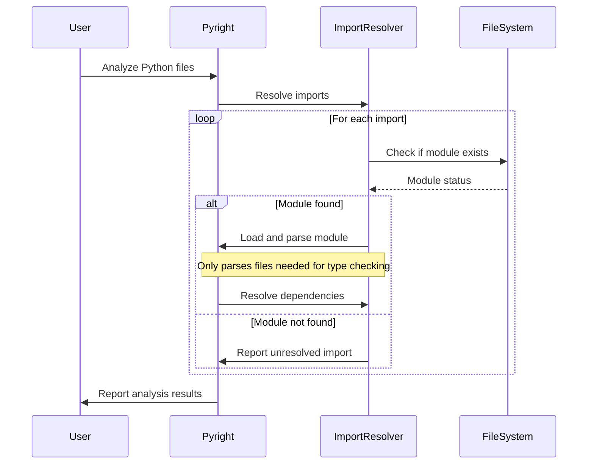

## Selective Parsing: Only Files Needed for Type Checking

Pyright optimizes performance by only parsing files that are actually needed for type checking. This means that if a module is imported but not used in a way that requires type information, it may not be parsed.

### Example Scenario


## Case 1:

**main.py:**
```python
from a import A
```

**a.py:**
```python
from b import B

class A:
    pass
```

**b.py:**
```python
class B:
    pass
```

### B is not needed for type checking main.py
If `main.py` only uses class `A` and doesn't actually use `B` for type checking purposes, then:
- ✅ `main.py` gets parsed (entry point)
- ✅ `a.py` gets parsed (needed for `A`)
- ❌ `b.py` might NOT be parsed (not needed for type checking `main.py`)

## Case 2:

**main.py:**
```python
from a import A, B
```

**a.py:**
```python
from b import B

class A:
    pass
```

**b.py:**
```python
class B:
    pass
```

### B is needed for type checking main.py
If `main.py` uses both `A` and `B` in ways that require type information, then:
- ✅ `main.py` gets parsed (entry point)
- ✅ `a.py` gets parsed (needed for `A`)
- ✅ `b.py` gets parsed (needed for `B` type checking)

The diagrams below show examples of actual import relationships that Pyright detected during parsing - these represent files that were actually needed for type checking in your project.


## Case 1:


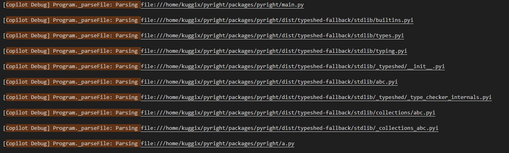


## Case 2:


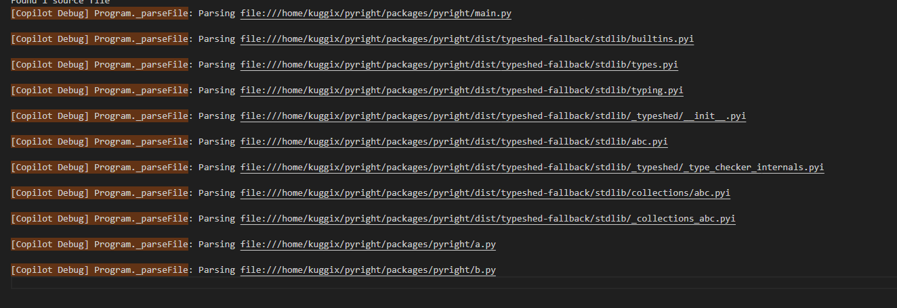


## builtins.pyi Imports

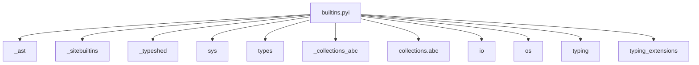

## your_python_file.py Imports

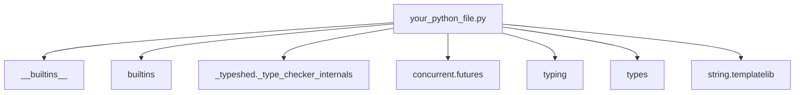

## _typeshed/_type_checker_internals.pyi Imports

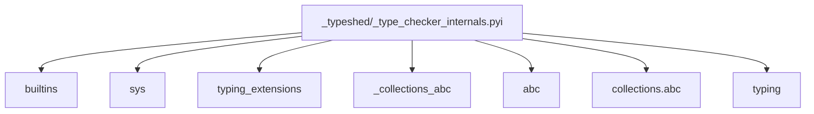

## types.pyi Imports

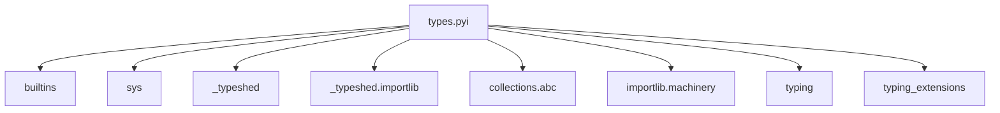

## typing.pyi Imports

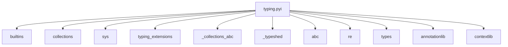

## _typeshed/__init__.pyi Imports

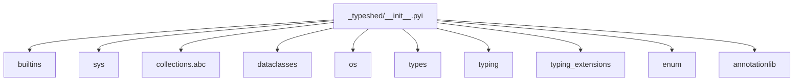

## concurrent/futures/__init__.pyi Imports

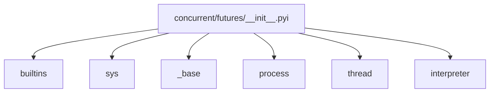

## concurrent/futures/thread.pyi Imports

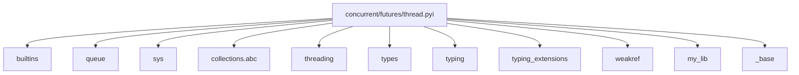


## Import Resolution Flow

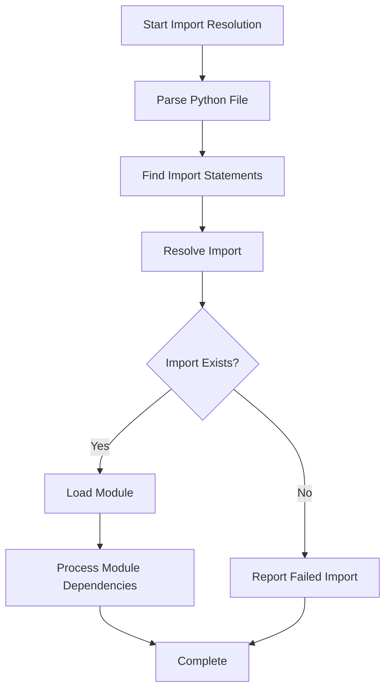
